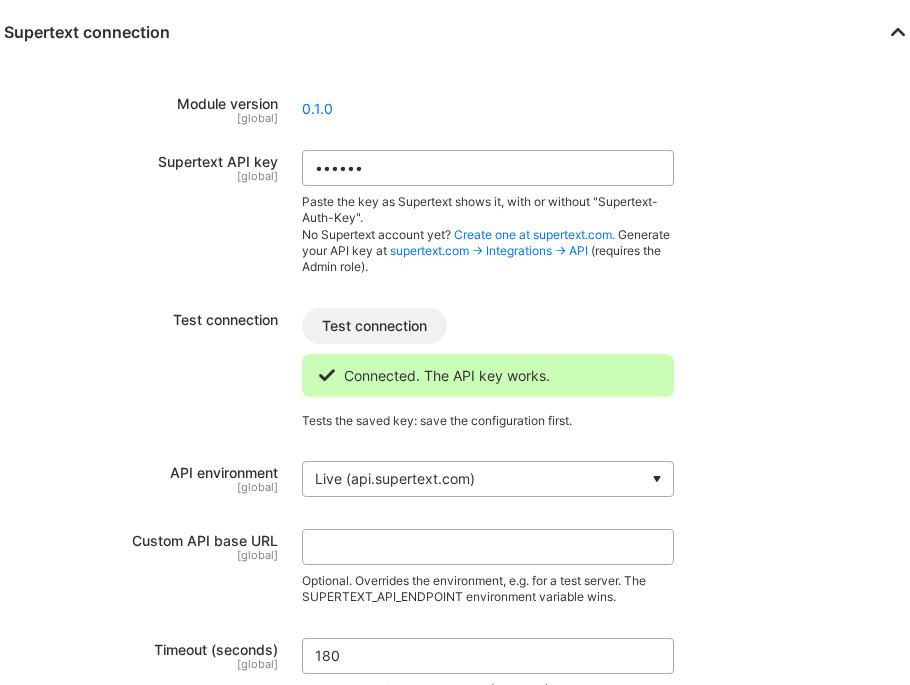
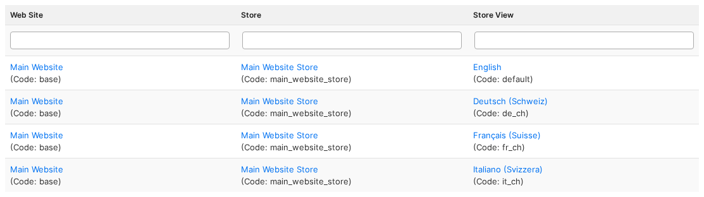
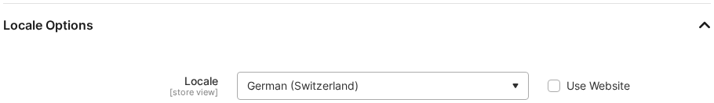
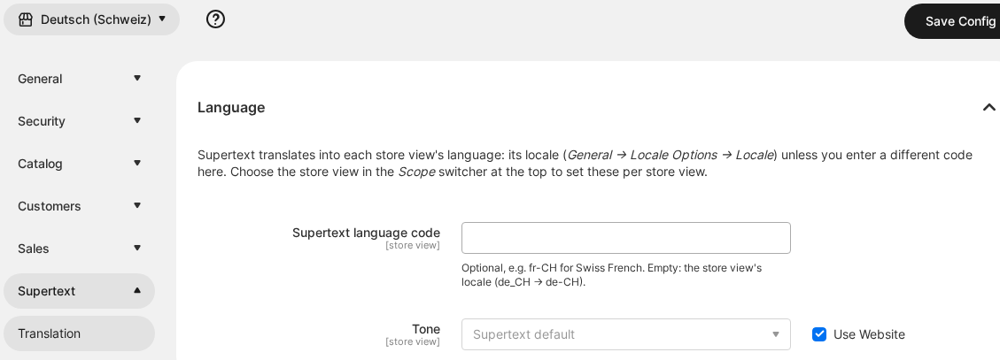

# Installation guide — Supertext Translation for Magento

For administrators setting up the module in a Magento 2 shop (Magento Open Source, Adobe Commerce or Mage-OS).

## Just want to try it?

A ready-to-run container with Mage-OS 3.5 (Magento 2.4.9), English sample products, a category, a CMS page and a block, store views for German (Switzerland), French (Switzerland) and Italian (Switzerland), and this module is in `demo/`. It is also what runs the public Supertext demo. See the *Demo* section of the [developer guide](DEVELOPER.md#demo-railway).

## Requirements

| | |
| --- | --- |
| Magento | Mage-OS 3.5 (Magento 2.4.9) tested; Magento Open Source and Adobe Commerce 2.4.7–2.4.9, Mage-OS 1.x–3.x supported, not yet tested |
| PHP | Whatever your Magento version needs (8.2–8.5), with `ext-dom` and `ext-curl` (or `allow_url_fopen`) |
| Store setup | A store view per language, each with its locale (step 3) |
| Supertext | An account with an API key, see [Get a Supertext account and API key](#get-a-supertext-account-and-api-key) |
| Network | The web server must reach `https://api.supertext.com` over HTTPS |

## 1. Install the module

The module isn't on the Adobe Commerce Marketplace yet. Install it with Composer, or copy it into `app/code`.

**With Composer** (recommended):

```bash
composer config repositories.supertext vcs https://github.com/Supertext/Magento-Supertext-Translation
composer require supertext/magento-supertext-translation:^0.1
```

**Or by hand:** download `magento-supertext-translation-<version>.zip` from the [Releases page](https://github.com/Supertext/Magento-Supertext-Translation/releases) (or build it with `./build.sh`) and unzip it into `app/code/Supertext/Translation`.

Then, in both cases:

```bash
bin/magento module:enable Supertext_Translation
bin/magento setup:upgrade
bin/magento setup:di:compile                 # production mode only
bin/magento setup:static-content:deploy      # production mode only
bin/magento cache:flush
```

`setup:upgrade` adds one table, `supertext_translation_link`, which records which CMS page or block is the translation of which.

## 2. Set the API key

### Get a Supertext account and API key

1. **Account:** no Supertext account yet? [Log in or create one](https://www.supertext.com/person/en/account/signin) with your email address.
2. **API key:** generate it at [supertext.com → Integrations → API](https://www.supertext.com/en/integrations/api). Only users with the **Admin** role in the Supertext account can do this; otherwise ask your Supertext account admin for a key.

The configuration page links to both, next to the API key field.

### Enter it in Magento

*Stores → Configuration → Supertext → Translation*, group **Supertext connection** (in the *Default Config* scope):

1. Paste your key into **Supertext API key** and click **Save Config**. You can paste it exactly as Supertext shows it, with the leading `Supertext-Auth-Key`, or without it. Magento stores it encrypted.
2. Click **Test connection**. *Connected. The API key works.* means everything is in place.



On servers you can set the key as the environment variable **`SUPERTEXT_API_KEY`** instead. It takes precedence over the field, keeps the key out of the database, and the configuration page then says that the environment variable is used.

## 3. Set up the languages

In Magento, a language is a **store view**. The module translates the default values (*All Store Views*) of your products, categories, pages and blocks into the store views, in each store view's language.

1. Add a store view per language: *Stores → All Stores → Create Store View*.

   

2. Set each store view's **locale**: *Stores → Configuration → General → General → Locale Options → Locale*, with the store view chosen in the scope switcher at the top.

   

The default values are taken to be in the default locale (*Default Config* scope; usually the language you write your catalog in). Store views in the same language as the source are not ticked when translating.

### Language codes and tone

By default the store view's locale (e.g. `de_CH` → `de-CH`) is sent to Supertext as the target language. In *Stores → Configuration → Supertext → Translation → Language*, with a store view chosen in the scope switcher, you can:

- send a **different code**, e.g. `fr-CH` for a store view whose locale is `fr_FR`, and
- choose the **tone**: *Formal (Sie, vous)*, *Informal (du, tu)* or the Supertext default (also settable for all store views or per website).



## 4. Check it works

Open *Catalog → Products*, select a product and choose **Translate with Supertext** in the **Actions** menu (see the [user guide](USER_GUIDE.md)). Or from the command line:

```bash
bin/magento supertext:translate product <id> [<id>…] [--store=de_ch --store=fr_ch] [--overwrite]
bin/magento supertext:translate category <id>
bin/magento supertext:translate cms_page <id>
bin/magento supertext:translate cms_block <id>
```

Without `--store`, every store view in another language than the default locale is translated.

## Who can translate

Admin users whose role allows **Translate with Supertext** (*System → Permissions → User Roles → Role Resources*) **and** editing the item: *Catalog → Inventory → Products* for products, *Catalog → Inventory → Categories* for categories, *Content → Elements → Pages → Save Page* for pages, *Content → Elements → Blocks* for blocks. The configuration needs *Stores → Settings → Configuration → Supertext Translation*. The *Administrators* role has all of these.

## All settings

| Setting | Scope | Default | Purpose |
| --- | --- | --- | --- |
| Supertext API key | Global | – | Your key, with or without the `Supertext-Auth-Key` prefix; stored encrypted. The `SUPERTEXT_API_KEY` environment variable wins. |
| API environment | Global | Live | `Live` (api.supertext.com), `Staging` or `Testing` Supertext API |
| Custom API base URL | Global | – | Overrides the environment (e.g. a test server). The `SUPERTEXT_API_ENDPOINT` environment variable wins. |
| Timeout (seconds) | Global | 180 | Maximum wait for one translation (30–1800) |
| Supertext language code | Store view | the store view's locale | Code sent to Supertext, e.g. `fr-CH` |
| Tone | Store view | Supertext default | Formal, informal or the Supertext default |
| CMS pages and blocks → Status of new translations | Global | Same as the original | Or *Disabled (review first)*. Only for new copies; translations of products and categories are store-view values and go live at once. |

## Updating

With Composer: `composer update supertext/magento-supertext-translation`; by hand: replace `app/code/Supertext/Translation`. Then run `bin/magento setup:upgrade` (and in production mode `setup:di:compile` and `setup:static-content:deploy`) and `cache:flush`. Settings are kept.

## Uninstalling

```bash
bin/magento module:disable Supertext_Translation
bin/magento setup:upgrade
composer remove supertext/magento-supertext-translation    # or delete app/code/Supertext/Translation
```

Translations made so far stay in your shop: store-view values of products and categories, and the page and block copies. The table `supertext_translation_link` stays too; drop it by hand if you like.

## Troubleshooting

| Message | Cause / fix |
| --- | --- |
| *Supertext is not set up yet* | No API key: enter it in the configuration (step 2), or set `SUPERTEXT_API_KEY`. |
| *Authentication failed* | The key is wrong or revoked. Check it with **Test connection**; if needed, generate a new one at [supertext.com → Integrations → API](https://www.supertext.com/en/integrations/api) (Admin role required). |
| *You are not allowed to edit this item* | The user's role lacks the resource for that kind of item (see *Who can translate*). |
| *Your shop has only one store view* | Add a store view per language (step 3). Magento in single-store mode has nothing to translate into. |
| *URL key "…" is already used in this store view* | Another product or category has that URL in the store view. The texts are translated, the URL key is kept; set one by hand. |
| *The original is assigned only to this store view* | The page or block is not in the source language's store views. Assign it to *All Store Views* or the source store views first. |
| *The translation could not be saved: …* | Magento rejected the copy (e.g. a page URL key conflict). The message names the reason. |
| *Too many requests to Supertext* | Supertext's per-second limit was still exceeded after 4 automatic retries. Wait a moment and translate again. |
| *Your Supertext translation limit is exceeded* | Your Supertext plan's volume is used up. |
| *Timed out waiting* | Very long content: raise the *Timeout* (and PHP's `max_execution_time`). |
| *Could not reach Supertext* | The server can't make outbound HTTPS calls; check the firewall or proxy (`HTTPS_PROXY`). |
| No **Translate with Supertext** in the Actions menu or on the edit page | Module disabled, missing `setup:upgrade` / `setup:di:compile`, or the user's role lacks *Translate with Supertext*. Flush the cache. |

Failed translations are logged to `var/log/system.log` (lines starting with `Supertext:`).

## Mage-OS's own automatic translation

Mage-OS 3 ships its own AI translation module (*Stores → Configuration → AI Integration*, DeepL or OpenAI), **off** by default. If you switch it on with periodic re-translation, it can overwrite store-view values that Supertext wrote, and the other way round. Use one of them per store view.

## Security notes

- Prefer the `SUPERTEXT_API_KEY` environment variable on servers: the key then never sits in the database or its backups.
- The module only talks to the Supertext API you configured. Documents are deleted from Supertext right after download (and expire after 24 hours anyway).
