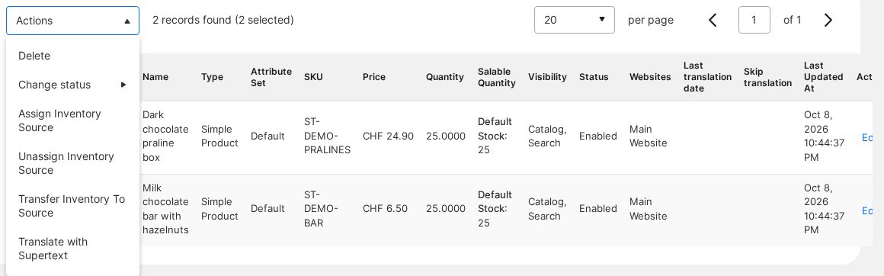
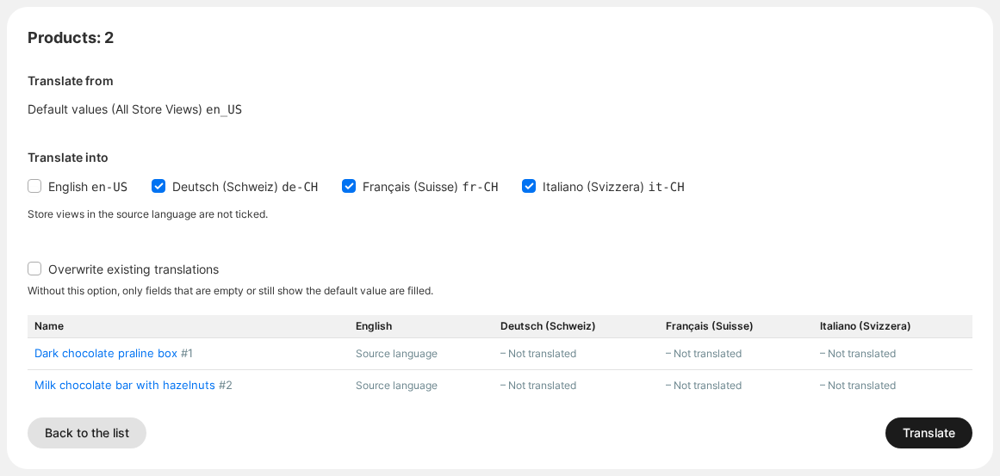
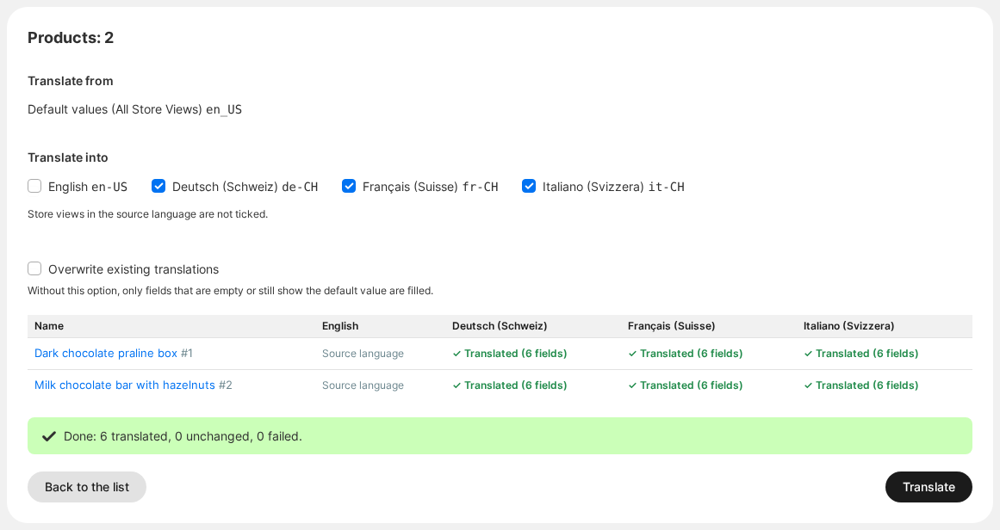
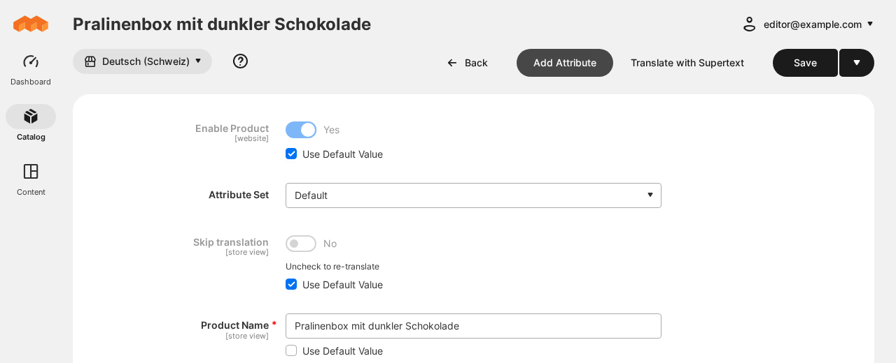
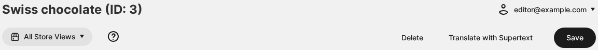
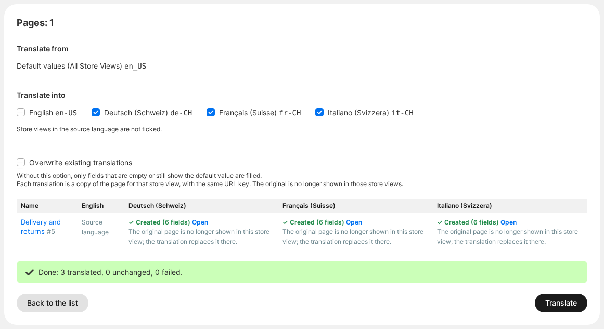
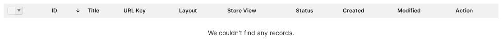
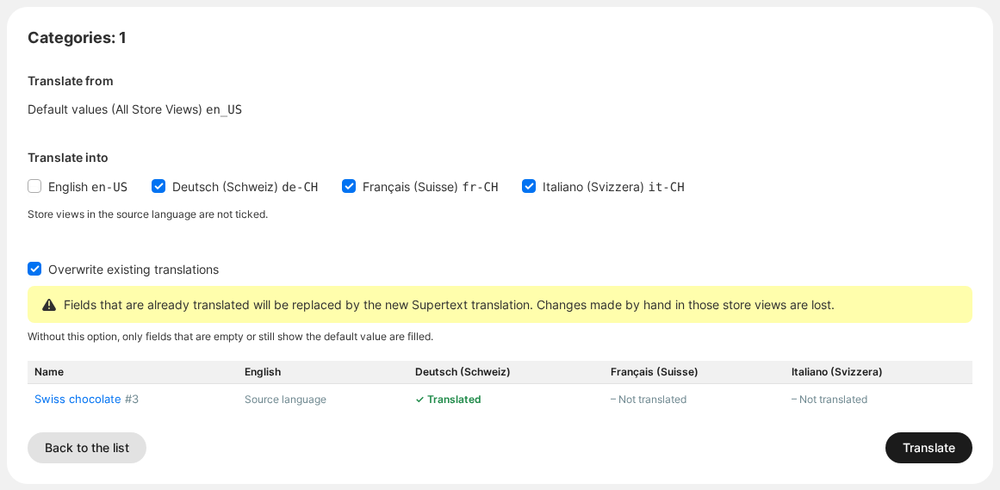

# User guide — Supertext Translation for Magento

For shop editors. Once an administrator has set up the module (see [INSTALLATION.md](INSTALLATION.md)), you translate products, categories, CMS pages and blocks from the Magento admin. Supertext writes the translation into your store views; you review it like any other edit.

## Try it on the demo

The Supertext Magento demo (ask Supertext for the address and an admin login) has two English sample products, the category *Swiss chocolate*, the CMS page *Delivery and returns* and the block *Chocolate promotion*, with store views for German (Switzerland), French (Switzerland) and Italian (Switzerland). Translate them as described below, then switch the store view in the shop's language switcher.

## How Magento stores translations

- **Products and categories** have one set of *default values* (scope *All Store Views*) and, per store view, their own values where needed. Supertext translates the default values and saves them as the store view's own values, which show up in that store view right away. The URL key follows the translated name.
- **CMS pages and blocks** have no store-view values. Supertext makes a **copy for each store view**, with the same URL key or identifier and the translated texts. A page's original is then no longer shown in those store views (Magento allows one page per URL and store view); a block's original keeps its store views, because Magento prefers the store view's own block.

## Translate products from the list

*Screenshots: Mage-OS 3.5 with the demo content.*

1. Open **Catalog → Products** and select the product(s) you want to translate.
2. Open **Actions** and choose **Translate with Supertext**.

   

3. The **Translate with Supertext** page lists the products with a column per store view showing how far each is translated already. Tick the store views to translate into: all store views in another language than the default values are ticked.

   

4. Click **Translate**. Each product and store view takes a few seconds; the table shows the result as it goes, and a summary when everything is done.

   

To see the result, open the product and choose the store view in the scope switcher at the top: the translated fields show the store view's own value (*Use Default Value* is off).

## Translate from an edit page

Products, categories, pages and blocks have a **Translate with Supertext** button at the top of their edit page. It translates the **saved** item, so save your changes first. Categories have no list with mass actions: open the category in *Catalog → Categories* and use the button.

## Translate CMS pages and blocks

**Content → Elements → Pages** and **Content → Elements → Blocks** have the same **Translate with Supertext** action in **Actions**. For each store view, the result shows *Created* (a new copy) with an **Open** link, or *Translated* when an existing copy was updated.

The page list then shows the original and its copies, each with its store view:

Whether new copies are enabled right away is a setting (*Same as the original*, or *Disabled* for review first). Translating the original again updates its copies; you can also edit a copy by hand like any page.

## Existing translations

Without any option, the module only fills fields that are **empty or still show the default value** in the store view. Fields with their own translation are kept, and the page says so: *Translated (5 fields) · 1 kept*, or *Already translated, unchanged* when there was nothing left to do. The store view columns show *Not translated*, *Partly translated* or *Translated* before you start.

To replace existing translations, tick **Overwrite existing translations**. The page warns you first: changes made by hand in those store views are lost.

## What is translated

| Item | Fields |
| --- | --- |
| Products | Name, short description, description, meta title, meta keywords, meta description; the URL key follows the name |
| Categories | Name, description, meta title, meta keywords, meta description; the URL key follows the name |
| CMS pages | Title, content heading, content, meta title, meta keywords, meta description (the URL key stays the same) |
| CMS blocks | Title, content (the identifier stays the same) |

- Rich text (descriptions, page and block content) keeps its formatting, links and Page Builder layout. Magento directives such as `{{widget …}}`, `{{store url=…}}` or `{{media url=…}}` are left untouched.
- The **URL key** of a product or category follows the translated name while the store view still uses the default URL key, or when you overwrite. A URL key you set by hand is kept. The old URL redirects to the new one.
- **Not translated** (yet): product attributes other than the ones above (e.g. custom text attributes, dropdown option labels), image labels, custom options, reviews, widgets' own settings, emails and the theme's texts (use Magento's translation CSV files or inline translation for those).

## Review

Products and categories: open the item, switch the scope to the store view and read the fields; the translation is live as soon as it is saved. Pages and blocks: open the copy (**Open** in the result, or the list). To check in the shop, switch the store view in the shop's language switcher.

## When something goes wrong

The table shows the reason for each item and store view that fails; the other ones still run.

| Message | What to do |
| --- | --- |
| *Supertext is not set up yet* | An administrator needs to enter the API key in the configuration. |
| *You are not allowed to edit this item* | Your role can't edit this kind of item; ask an administrator. |
| *Authentication failed* | The API key is no longer valid; tell your administrator. |
| *URL key "…" is already used in this store view* | The texts are translated; give the item a different URL key by hand in that store view. |
| *The original is assigned only to this store view* | The page or block belongs to that store view already; assign it to the source language's store views first. |
| *Too many requests to Supertext* | Wait a moment and click **Translate** again. Items already done show *Already translated, unchanged*. |
| *Your Supertext translation limit is exceeded* | Your Supertext plan's volume is used up; tell your administrator. |
| *Timed out waiting for the Supertext translation* | Very long texts. Try again, or ask your administrator to raise the timeout. |
